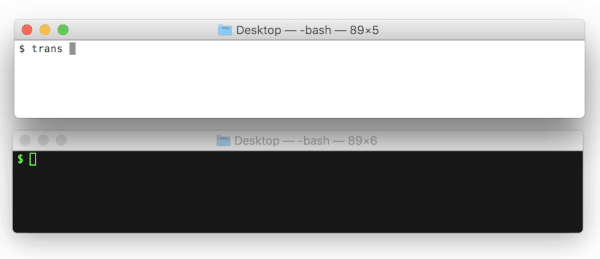

# trans-cli

Command Line Interface for [Trans Server](https://github.com/nwtgck/trans-server-akka)

| branch | Travis status|
| --- | --- |
| [`master`](https://github.com/nwtgck/trans-cli-go/tree/master) |[](https://travis-ci.com/nwtgck/trans-cli-go) |
| [`develop`](https://github.com/nwtgck/trans-cli-go/tree/develop) | [](https://travis-ci.com/nwtgck/trans-cli-go) |




## Installation

```bash
brew install nwtgck/homebrew-trans/trans
```

## Send/Get File

Commands bellow are examples of sending/getting.

### Send

```bash
trans send ./my_video.mp4
```

### Get

```bash
trans get jht
```

(File ID, `jht` is saved as `jht` file in `$PWD`)


## Other Usages

### Change Server

Command bellow sets Trans Server URL to <https://trans-akka.herokuapp.com>.

```bash
trans server https://trans-akka.herokuapp.com
```

Use `trans server --show` to print server URL.

### Delete a file

```bash
trans delete jht
```

### Safe Sending with Long ID

Use `-l` or `--id-length` to specify File ID length.

```bash
$ trans send -l 32 my_video.mp4
mn6pbf8jtxfvesct8zcpzwbxe4e5i85v
```

### Safe Sending with Limit

Use `-t` or `--get-times` to specify download-limit.

```bash
$ trans send -t 1 my_video.mp4
ab2
```

### Safe Sending with Store Duration

Use `--duration` to specify store duration.

```bash
$ trans send --duration=30s my_video.mp4
ab2
```


## Other Flags

Use `trans send -h` to know more information.


```bash
$ trans send -h
Send a file

Usage:
  trans send [flags]

Flags:
      --deletable           whether file is deletable or not (default true)
      --delete-key string   key for deletion
      --duration string     store duration (e.g. 10s, 5m, 12h, 3d) (default "1h")
  -t, --get-times int       download limit (e.g. 1, 10) (default 100)
  -h, --help                help for send
  -l, --id-length int       length of ID (e.g. 3, 10) (default 3)
  -q, --quiet               disable progress bar or not

Global Flags:
  -s, --server string   Trans Server URL
```
